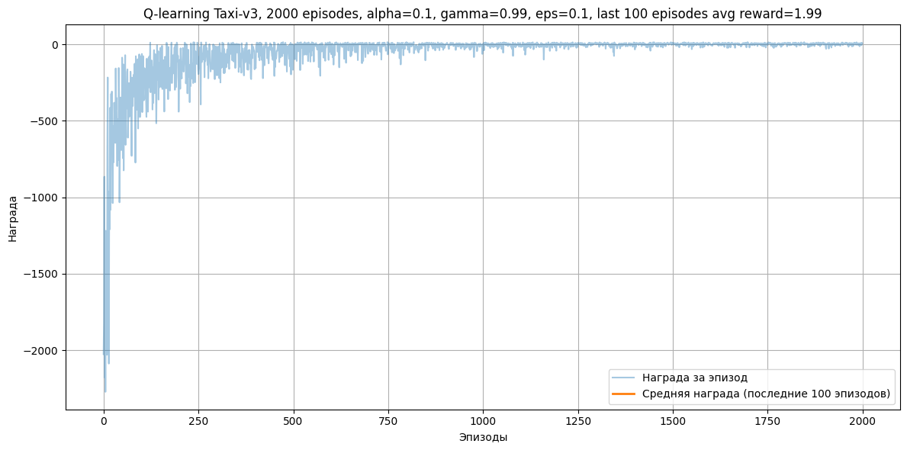
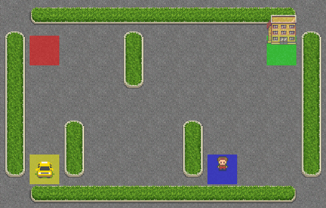

# Домашнее задание 1
### Разработка агента для решения задачи с конечным набором состояний и действий
* Реализовать один из алгоритмов RL (Q-learning)
* Реализовать логику обучения агента, используя среду из Gymnasium
* Решить задачу Taxi-v3
* Сделать отчет об обучении агента (графики награды)

Результат должен содержать исходный код агента, сохраненного агента, графики награды в процессе обучения агента.

### Результат
* Исходный код агента и графики награды с разным количеством эпизодов при обучении размещены в ноутбуке [hw1.ipynb](./hw1.ipynb)
* Агент, обученный на максимальном количестве эпизодов, сохранен в файле [q_table_taxi.npy](./q_table_taxi.npy)
* Дополнительно была реализована визуализация работы агента в виде анимации gif.

### Визуализация
Визуализация работы агента, обученного на максимальном количестве эпизодов из числа проведенных экспериментов:
 

