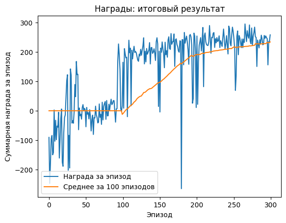
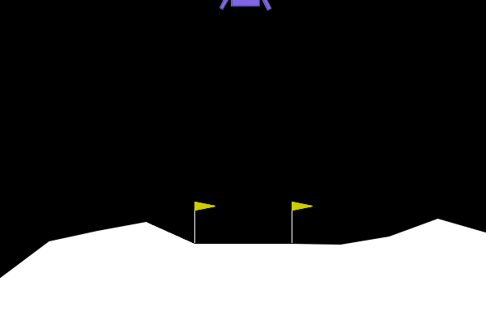

# Домашнее задание 2
### Реализация DQN и обучение на Lunar Lander
* Реализовать алгоритм DQN с реплей буффером и мягким обновлением целевой сети
* Обучить агента в среде Lunar Lander

Результат должен содержать исходный код, обученного агента и график средней награды за эпизод и средней наградой за 100 эпизодов по мере обучения агента.

### Результат
* Исходный код агента и графики награды с разным количеством эпизодов при обучении размещены в ноутбуке [hw2.ipynb](./hw2.ipynb)
* Агент, обученный на максимальном количестве эпизодов, сохранен в файле [torchDQN.pt](./torchDQN.pt)
* Дополнительно была реализована визуализация работы агента в виде анимации gif.

### Визуализация
Визуализация работы агента, обученного на максимальном количестве эпизодов из числа проведенных экспериментов:

