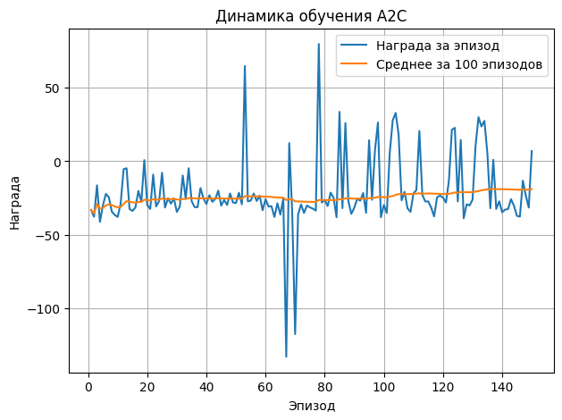

# Домашнее задание 3
### Задача с непрерывным спектром действий в непрерывной среде
* Реализовать алгоритм на основе политик А2С, DDPG
* Обучить агента в среде Car Racing

Результат должен содержать исходный код, обученного агента и графики обучения агента. 
Критерий успешности: средняя награда агента повышается по мере обучения.

### Результат
* Исходный код агента и графики награды при обучении размещены в ноутбуке [hw3.ipynb](./hw3.ipynb)
* Агент, обученный на 150 эпизодах, сохранен в файле [actor.pt](./actor.pt)
* Дополнительно была реализована визуализация работы агента в виде анимации gif.

### Визуализация
Визуализация работы агента, обученного на 150 эпизодах:

При текущих гиперпараметрах и на небольшом количестве эпизодов агент не справляется с задачей, однако по графику средней награды видно, что происходит медленный рост. Это подтверждает обучаемость агента в ручной реализации на Torch.

