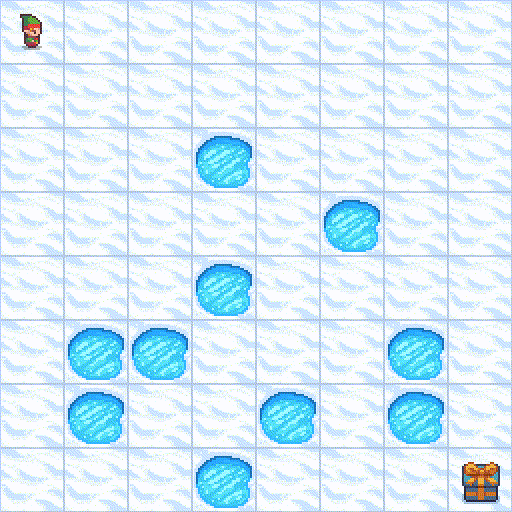

# Домашнее задание 4
### Обучение Dyna-Q агента для стохастической среды
* Реализовать класс, моделирующий стохастическую среду Frozen Lake 8x8
* Обучить агента Dyna-Q, использующего стохастическую модель среды и сравнить с простым Q-агентом

### Результат
* Исходный код и графики при обучении размещены в ноутбуке [hw4.ipynb](./hw4.ipynb)
* Дополнительно был проведен эксперимент с обучением Dyna-Q с разным числом шагов планирования (30 и 5)
* Выводы по итогам проведенных экспериментах также представлены в ноутбуке

### Пример успешно пройденного эпизода агентом Dyna-Q
